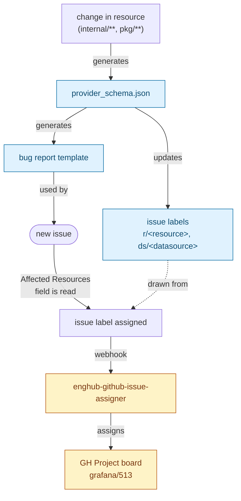
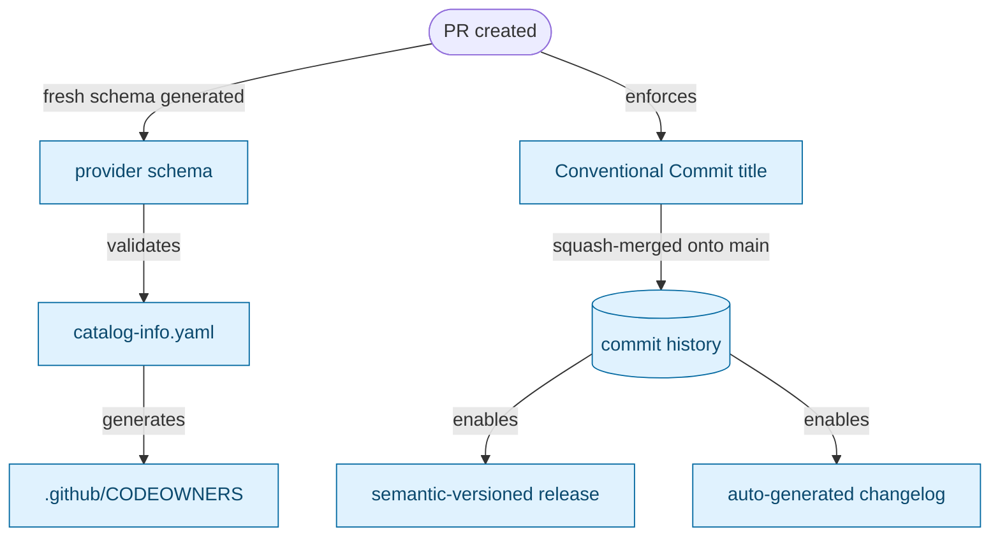

# `.github/` automation

This directory contains the GitHub-side automation that ties the provider's
resource schema to issue triage, PR conventions, and releases. The
workflows are intentionally interconnected: the generated provider schema
drives the bug-report template, the GitHub issue labels, and (via the
Backstage catalog) per-resource CODEOWNERS; Conventional Commit titles in
turn drive the release changelog and version bumps.

This README explains how the pieces fit together. For day-to-day contribution
rules see [`CONTRIBUTING.md`](../CONTRIBUTING.md); for releases see
[`RELEASING.md`](../RELEASING.md).

## Two flows

The automation is best understood as two largely independent pipelines,
each described in terms of the artifacts it produces and the dependencies
between them. The GitHub Actions workflows are listed in the
[Quick reference](#quick-reference) at the bottom — they are *implementations*
of the dependencies shown below.

1. **Issue pipeline** — propagates resource changes into the bug report
   template and issue labels, then routes new issues to the right project.
2. **Contribution & release pipeline** — every PR validates the schema,
   catalog, and CODEOWNERS chain, and enforces Conventional Commits, which
   in turn enables semantic-versioned releases and an auto-generated
   changelog.

## Issue pipeline

## Contribution & release pipeline

### `update-schema.yml` — keep schema and bug template in sync

- **Trigger:** push to `main` touching `internal/**`, `pkg/**`, `go.mod`, or
  `go.sum`.
- **What it does:** runs `scripts/generate_schema.sh` plus
  `scripts/generate_issue_template.go --update-schema`, then opens a PR
  (`automated/update-schema`) with the updated `provider_schema.json` and
  `.github/ISSUE_TEMPLATE/1-bug-report.yml`.
- **PR is auto-approved and auto-merged** via a GitHub App token issued by
  `grafana/shared-workflows/actions/create-github-app-token` (app:
  `terraform-provider-grafana`).
- **Why a GitHub App token, not `GITHUB_TOKEN`?** Pushes made with the default
  `GITHUB_TOKEN` are suppressed from triggering downstream workflows
  (anti-recursion). Using the app token lets the merge push trigger
  `sync-labels.yml`, which would otherwise never see the new schema.

### `sync-labels.yml` — schema → repo labels

- **Trigger:** push to `main` that modifies `provider_schema.json` (also
  available via `workflow_dispatch`).
- **What it does:** reads every resource and data source from
  `provider_schema.json` and creates any missing labels:
  - resources → `r/<name>` (color `#0075ca`), `grafana_` prefix stripped
  - data sources → `ds/<name>` (color `#e4e669`)
- It only **creates** missing labels; it does not delete or rename existing
  ones. Renames must be handled manually.

### `issue-label-resources.yml` — bug report → labels

- **Trigger:** issue `opened` or `edited`.
- **What it does:** parses the **Affected Resource(s)** dropdown from the bug
  report body, maps each entry like `grafana_dashboard (resource)` to
  `r/dashboard` (or `ds/...`), and applies them.
- Stale `r/*`/`ds/*` labels are stripped first, so editing the dropdown is
  reflected accurately.
- **Skips issue #2389** (Renovate Dependency Dashboard) by hard-coded number.
- The catch-all option `Other (please describe in the issue)` is ignored.

### enghub-github-issue-assigner (external webhook)

The Platform Monitoring team operates an external webhook that watches issue
events and assigns issues to the appropriate **GitHub Project** based on the
labels applied above. For this repo it pins issues to project
[`grafana/513`](https://github.com/orgs/grafana/projects/513) (already
referenced in the issue templates' `projects:` front-matter).

The webhook is **not** configured from this repo. For changes to its routing
rules, contact the Platform Monitoring team.

### `validate-catalog.yml` — catalog ↔ schema check

- **Trigger:** every pull request.
- **What it does:** the composite action `.github/actions/validate-catalog`
  **regenerates the provider schema fresh from the PR's source**
  (`scripts/generate_schema.sh`) — it does **not** read the committed
  `provider_schema.json`. Then `validate.jsonnet` checks that every
  resource and data source in `catalog-info.yaml` exists in that
  freshly-built schema, and vice versa.
- Because the schema is regenerated in CI, contributors do **not** need to
  commit `provider_schema.json` updates in the same PR that adds a new
  resource. That file is reconciled separately by `update-schema.yml`
  (see below) once the change is on `main`.

### `codeowners-check.yml` — CODEOWNERS is generated, not hand-written

- **Trigger:** pull request and pushes to `main`.
- **What it does:** runs `make codeowners-check`
  (`go run ./tools/codeowners --check`). The check fails if
  `.github/CODEOWNERS` drifts from what `tools/codeowners` would generate
  from `.github/CODEOWNERS.in` (static rules) plus the per-resource
  ownership derived from `catalog-info.yaml` and Go AST scanning of the
  resource registrations. It does **not** read the schema JSON.
- **Pairs with `validate-catalog.yml`.** Validate-catalog confirms that the
  catalog matches the actual provider source; codeowners-check confirms
  that CODEOWNERS matches the catalog. Together they prevent merging a new
  resource with missing or stale ownership.
- **To regenerate after editing ownership:** `make codeowners`. Edit
  `CODEOWNERS.in` (not `CODEOWNERS`) for static rules.

### `pr-title.yml` — Conventional Commits enforcement

- **Trigger:** PR `opened`, `reopened`, `edited`, `synchronize`.
- **What it does:** runs `amannn/action-semantic-pull-request` to validate
  the title against the Conventional Commits format
  `<type>(<scope>): <subject>`.
- **Allowed types:** `feat`, `fix`, `docs`, `style`, `refactor`, `perf`,
  `test`, `chore`, `ci`, `build`.
- Subject must not start with an uppercase letter.
- A sticky comment posts the rules on failure and is automatically deleted
  once the title is valid.
- Because the repo uses **squash merges**, the PR title becomes the commit
  message — which is what `release.yml` later parses (via `git-cliff`) to
  assemble the changelog and determine the next version bump. Title format
  is therefore not cosmetic; it is a **hard prerequisite** for the release
  pipeline below.

### `release.yml` — tag → signed release

- **Trigger:** push of a tag matching `v*`.
- **Steps:**
  1. **Generate release notes** with
     [`git-cliff`](https://git-cliff.org/) (`--latest --strip header`),
     using [`cliff.toml`](../cliff.toml) at the repo root. Conventional commit
     types are mapped to changelog sections (Features, Bug Fixes,
     Documentation, …).
  2. **Compute the minimum required version** with `git-cliff --bumped-version`.
     Per `cliff.toml`:
     - `feat` → minor bump
     - `refactor` / `perf` → minor bump (`custom_minor_increment_regex`)
     - any breaking change (`!` in the type/scope) → major bump
     - everything else → patch
  3. **Semver gate.** Compare the pushed tag against the computed minimum and
     fail the job if the tag would under-bump (e.g. tagging `v3.7.1` when a
     `feat` since the last release would have required `v3.8.0`).
  4. **Import GPG key** from Vault via
     `grafana/shared-workflows/actions/get-vault-secrets` and
     `crazy-max/ghaction-import-gpg`.
  5. **Run GoReleaser** with `--release-notes=/tmp/goreleaser-release-notes.md`.
     The notes are copied out of the working tree because GoReleaser refuses
     to run on a dirty git state and `git-cliff-action` writes into
     `git-cliff/`.
- **Cloud acceptance tests as a pre-release gate** are currently commented out
  in `release.yml` (flakiness, see the inline comment). Re-enable by
  uncommenting the `run-cloud-tests` job and the `needs:` reference.
- See [`RELEASING.md`](../RELEASING.md) for the human-side checklist.

## Quick reference

| Workflow | Trigger | Purpose | Side effects |
|---|---|---|---|
| [`update-schema.yml`](workflows/update-schema.yml) | push to `main` (`internal/**`, `pkg/**`, `go.{mod,sum}`) | Regenerate `provider_schema.json` and bug-report template | Auto-approved + auto-merged PR on `automated/update-schema` (uses GitHub App token) |
| [`sync-labels.yml`](workflows/sync-labels.yml) | push to `main` modifying `provider_schema.json`; `workflow_dispatch` | Create missing `r/*` and `ds/*` labels from the schema | Creates labels (does not delete) |
| [`issue-label-resources.yml`](workflows/issue-label-resources.yml) | issue `opened` / `edited` | Apply `r/*` and `ds/*` labels from bug report's "Affected Resource(s)" | Edits issue labels; skips issue #2389 |
| [`validate-catalog.yml`](workflows/validate-catalog.yml) | pull request | Validate `catalog-info.yaml` against the regenerated schema (jsonnet) | Fails PR on mismatch |
| [`codeowners-check.yml`](workflows/codeowners-check.yml) | PR + push to `main` | Verify `.github/CODEOWNERS` matches generator output | Fails PR on drift; regenerate with `make codeowners` |
| [`pr-title.yml`](workflows/pr-title.yml) | PR `opened` / `reopened` / `edited` / `synchronize` | Enforce Conventional Commits in PR titles | Fails PR + posts sticky comment with format rules |
| [`release.yml`](workflows/release.yml) | push of tag `v*` | git-cliff changelog → semver gate → GPG-signed GoReleaser release | Publishes GitHub Release and signed artifacts |
| enghub-github-issue-assigner *(external)* | label changes on issues | Route issues to GH Project [`grafana/513`](https://github.com/orgs/grafana/projects/513) | Project assignment; managed by the Platform Monitoring team |

## Related files

- [`../provider_schema.json`](../provider_schema.json) — the source of truth
  consumed by `sync-labels.yml`, `issue-label-resources.yml` (indirectly via
  the bug template), and `validate-catalog.yml`.
- [`../scripts/generate_schema.sh`](../scripts/generate_schema.sh) and
  [`../scripts/generate_issue_template.go`](../scripts/generate_issue_template.go)
  — generate the schema JSON and bug-report template.
- [`CODEOWNERS`](CODEOWNERS), [`CODEOWNERS.in`](CODEOWNERS.in), and
  [`../tools/codeowners/`](../tools/codeowners) — generator inputs/outputs.
- [`ISSUE_TEMPLATE/`](ISSUE_TEMPLATE) — issue forms; `1-bug-report.yml` is
  generated, others are hand-edited.
- [`actions/validate-catalog/`](actions/validate-catalog) — composite action
  used by `validate-catalog.yml`.
- [`../cliff.toml`](../cliff.toml) — git-cliff config: commit-type → changelog
  group mapping and bump rules used by `release.yml`.
- [`../CONTRIBUTING.md`](../CONTRIBUTING.md) — PR title format reference.
- [`../RELEASING.md`](../RELEASING.md) — human-side release checklist.
